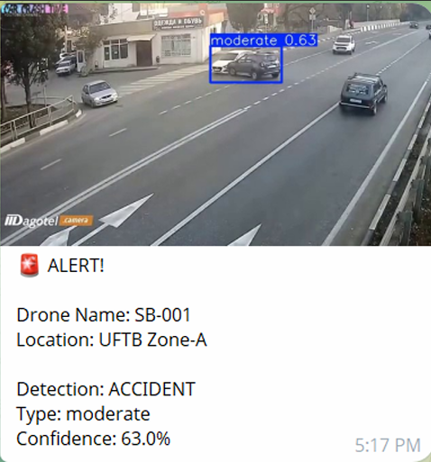
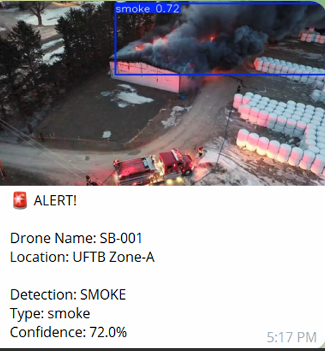
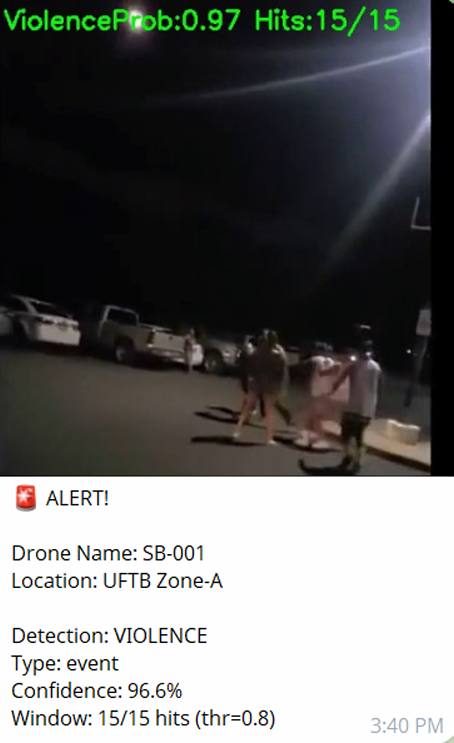
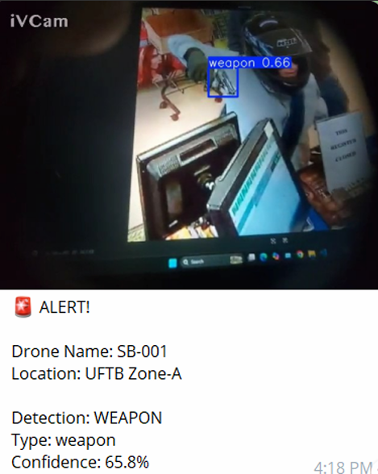

# AI-Driven Autonomous Aerial Surveillance System for Real-Time Multi-Threat Detection

An intelligent drone-based surveillance system that uses deep learning and edge computing to automatically detect multiple public safety threats such as **fire, accidents, weapons, and violent activities** in real time.

The system runs AI models on a **Raspberry Pi edge device** mounted on a UAV and sends **instant alerts through Telegram** when a threat is detected.

---

# Project Overview

Traditional surveillance systems such as fixed CCTV cameras have limited coverage and require constant human monitoring. This project proposes an **AI-powered aerial monitoring system** using drones and deep learning models to improve situational awareness and rapid response.

The system integrates:

- UAV-based aerial monitoring
- Edge AI processing on Raspberry Pi
- Multi-threat object detection using YOLO
- Violence classification using CNN
- Real-time alert notification using Telegram Bot

---

# Key Features

- Real-time aerial surveillance using UAV
- Multi-threat detection:
  - Fire and smoke
  - Traffic accidents
  - Weapon detection
  - Violent activity detection
- Edge AI inference using Raspberry Pi
- Telegram bot alert system
- Evidence frame capture and logging
- Modular detection pipeline
- Lightweight models for real-time performance

---

# System Architecture

The proposed system consists of the following components:

1. **Drone Platform**
   - UAV equipped with Raspberry Pi and camera module.

2. **Video Capture**
   - Real-time video frames captured from drone camera.

3. **Threat Detection Models**
   - YOLO-based object detection for:
     - Fire / Smoke
     - Accidents
     - Weapons
   - CNN-based classifier for violence detection.

4. **Temporal Validation**
   - Multiple frame verification to reduce false positives.

5. **Alert System**
   - Confirmed events trigger an alert through Telegram Bot.

---

# Project Structure

```
DRONE_SURVEILLANCE_AI
│
├── app.py
├── requirements.txt
├── .gitignore
│
├── data/
│   ├── alert/
│   └── captures/
│
├── detectors/
├── models/
├── tools/
├── utils/
├── figures/
│
├── convert_weapon_to_one_class.py
├── extract_frames.py
├── fix_names.py
├── get_chat_id.py
├── make_roc_violence.py
├── split_videos.py
├── train_violence_cls.py
├── violence_event.py
│
└── Dataset_ref.txt
```

---

# Demo Videos

Due to GitHub file size limitations, the demonstration videos are provided via Google Drive.

**Demo Video Folder**

https://drive.google.com/drive/folders/1dIA9ZqcjGgwMMgntgV2ZicAMQnGI7Y8r

Contents:

- Drone_Fly.mp4 – Demonstration of drone flight and aerial capture
- model_work.mp4 – Demonstration of AI-based threat detection

---
# Alert Notification Examples

When the system detects a threat event, it automatically sends an alert message to authorized users through a Telegram Bot.  
Each alert contains the **type of detected threat** and an **evidence image captured from the drone camera**.

Below are example alert notifications generated by the system.

### Accident Detection Alert


### Fire and Smoke Detection Alert


### Violence Detection Alert


### Weapon Detection Alert


# Installation

Clone the repository:

```
git clone https://github.com/your-username/drone-surveillance-ai.git
cd drone-surveillance-ai
```

Create virtual environment:

```
python -m venv venv
```

Activate environment:

Windows

```
venv\Scripts\activate
```

Linux / Mac

```
source venv/bin/activate
```

Install dependencies:

```
pip install -r requirements.txt
```

---

# Running the System

Run the main application:

```
python app.py
```

The system will:

1. Capture video frames  
2. Run threat detection models  
3. Validate events across frames  
4. Send alert notifications through Telegram  

---

# Datasets

Due to size limitations, the datasets are **not included in this repository**.

The datasets used in this project include:

- Fire and smoke dataset
- Weapon detection dataset
- Violence detection dataset
- Accident detection dataset

Dataset references are provided in:

```
Dataset_ref.txt
```

---

# Model Information

The project uses lightweight deep learning models suitable for edge deployment:

- YOLO-based models for object detection
- CNN classifier for violence detection

Large trained model weights are not included in the repository.

---

# Technologies Used

- Python
- PyTorch
- YOLO
- OpenCV
- Raspberry Pi
- UAV Drone Platform
- Telegram Bot API

---

# Research Context

This project is developed as part of a **Capstone Research Project** on intelligent surveillance systems.

The work explores the integration of **UAV platforms, edge AI, and deep learning models** to improve public safety monitoring.

---

# Authors

**MD Naimur Hamim** | **Redwan Bin Jalal** | **Md. Ashiqussalehin**

Department of IoT and Robotics Engineering  
University of Frontier Technology  
Gazipur-1750, Bangladesh  

**Corresponding Author:** Md. Ashiqussalehin  
📧 Email: ashiqussalehin@uft.edu.bd

---

## License

This project is licensed under the MIT License.
